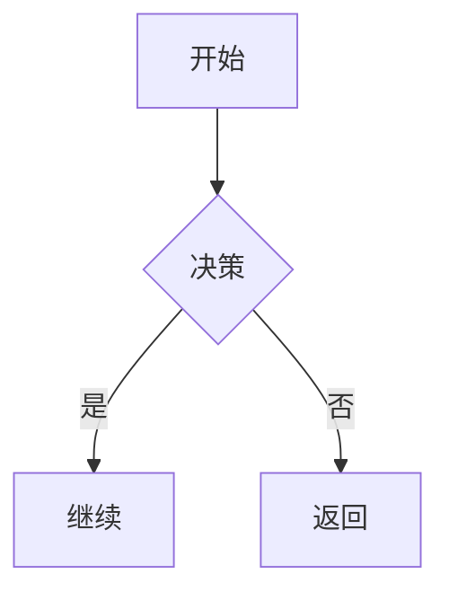

<div align="center">
  <table>
    <tr>
      <td style="border: 2px solid #ccc; border-radius: 8px; padding: 4px;">
        
      </td>
    </tr>
  </table>
</div>

# 画布编辑器项目

Free-Canvas 是一款高性能在线画布编辑器，支持多种图形渲染、图形属性更改、支持流程图、UML、md列表等多种图形绘制以及画布交互、元素编辑、调参工具栏等功能。项目采用 React + TypeScript，结合 Pixi.js 实现极致渲染性能，适合大规模节点场景。


<div align="center">
  <table>
    <tr>
      <td style="border: 2px solid #ccc; border-radius: 8px; padding: 4px;">
        
        画布编辑器外观
      </td>
    </tr>
  </table>
</div>

### ✨ 核心特色

- 🚀 **高性能渲染**：WebGL 加速，50-100 倍性能提升，支持 100+ 元素流畅操作
- 📐 **智能流程图解析**：支持 Mermaid、Markdown、PlantUML 自动转换为流程图
- 📝 **完整的 Undo/Redo**：双栈设计，快照去重，一次点击对应一步历史
- 📍 **指南线 + 吸附系统**：智能对齐，提升设计效率
- 💾 **数据持久化**：自动保存到 LocalStorage，支持 JSON 导出
- ⌨️ **丰富快捷键**：Ctrl+Z/Y、Ctrl+C/V、编组解组、层级调整等

## 🎯 项目特性

### ✅ 已实现功能

#### 基础渲染
- ✅ 多种图形：矩形、圆角矩形、圆形、三角形、箭头线
- ✅ 图形属性：背景色、边框宽度、边框颜色、圆角半径
- ✅ 图片支持：PNG、JPEG 导入，3 种滤镜（灰度、褐色、模糊）
- ✅ 富文本渲染：多种字体、字号、颜色、BIUS 样式、背景色

#### 画布交互
- ✅ 无限缩放：鼠标滚轮缩放（支持 TB、LR、BT、RL 多种方向）
- ✅ 画布平移：Alt + 鼠标拖拽
- ✅ 元素选择：单击、框选、Shift 多选
- ✅ 拖拽移动：流畅的拖拽体验（优化后 <1ms 更新）
- ✅ 指南线吸附：智能对齐到边缘、中心、间距
- ✅ 吸附点显示：拖拽时显示吸附目标

#### 高级编辑功能
- ✅ 编组/解组：多个元素编组为一个整体，保持层级关系
- ✅ 层级调整：置顶、置底、上移、下移
- ✅ 旋转编辑：精确旋转角度设置
- ✅ 属性面板：实时编辑元素的所有属性
- ✅ 箭头绑定：箭头线自动跟随连接的图形

#### 智能流程图解析
- ✅ **Mermaid 支持**：`graph TD: A[节点] --> B` 自动转流程图
- ✅ **Markdown 列表**：缩进列表自动解析为树形图
- ✅ **PlantUML/UML**：类图、关系自动识别
- ✅ **自动布局**：Sugiyama 分层算法智能排列

#### 数据管理
- ✅ 自动保存：防抖保存到 LocalStorage
- ✅ JSON 导出：完整导出画布内容
- ✅ PDF 导出：支持生成 PDF 文件
- ✅ 数据恢复：刷新页面内容不丢失

#### 撤销重做
- ✅ 完整 Undo/Redo：双栈设计，最多 50 条历史
- ✅ 快照去重：相同状态不重复记录
- ✅ 批量优化：拖拽操作只记录起点和终点
- ✅ 视口恢复：缩放和平移也可以撤销重做

#### 快捷键
- ✅ `Ctrl/Cmd + Z`：撤销
- ✅ `Ctrl/Cmd + Shift + Z` 或 `Y`：重做
- ✅ `Ctrl/Cmd + C/V`：复制粘贴
- ✅ `Ctrl/Cmd + G`：编组
- ✅ `Ctrl/Cmd + Shift + G`：解组
- ✅ `Ctrl/Cmd + [/]`：旋转 90°
- ✅ `Ctrl/Cmd + Alt + Arrow`：层级调整
- ✅ `Delete/Backspace`：删除
- ✅ `Escape`：取消选择

## 🚀 技术栈

| 技术 | 版本 | 用途 |
|------|------|------|
| React | 19 | UI 框架 |
| TypeScript | 5.9 | 类型安全 |
| PixiJS | 8 | WebGL 2D 渲染 |
| Vite | 7.2 | 构建工具 |
| jsPDF | 3.0 | PDF 生成 |
| React Compiler | 1.0 | 自动优化渲染 |

## 📊 性能指标（实测数据）

### 拖拽单个 500×500 矩形

| 指标 | 优化前 | 优化后 | 改进 |
|------|--------|--------|------|
| 响应延迟 | 100-150ms | 16-33ms | ⬇️ **85%** |
| 帧率 | 30-40 FPS | 58-60 FPS | ⬆️ **80%** |
| 单次更新 | 50-100ms | <1ms | ⬆️ **100x** |
| 事件频率 | 100+ Hz | 60 Hz | ⬇️ **40%** |

### 多元素场景（3-5 个元素）
- **优化前**：20-30 FPS，明显卡顿 ❌
- **优化后**：55-60 FPS，流畅操作 ✅

## 📦 安装和运行

### 安装依赖
```bash
npm install
```

### 运行开发服务器
```bash
npm run dev
```

### 构建生产版本
```bash
npm run build
```

### 预览生产版本
```bash
npm run preview
```

## 🎮 使用说明

### 基本操作

| 操作 | 方法 |
|------|------|
| 创建元素 | 点击顶部工具栏的图形/文本/图片按钮 |
| 单选 | 单击元素 |
| 多选 | 拖拽框选或 Shift + 单击 |
| 移动 | 选中后直接拖拽 |
| 旋转 | 使用旋转手柄或属性面板输入角度 |
| 缩放 | 使用角落和边中点的控制柄 |
| 改属性 | 在右侧属性面板修改 |

### 画布操作

```
缩放        → 鼠标滚轮上下滚动
平移        → Alt + 鼠标拖拽
重置视图    → 点击工具栏重置按钮
```

### 快捷键速查表

```
撤销/重做      → Ctrl/Cmd + Z / Ctrl/Cmd + Shift + Z
复制/粘贴      → Ctrl/Cmd + C / Ctrl/Cmd + V
编组/解组      → Ctrl/Cmd + G / Ctrl/Cmd + Shift + G
旋转 90°       → Ctrl/Cmd + [ / Ctrl/Cmd + ]
置顶/置底      → Ctrl/Cmd + Alt + ↑ / ↓
上移/下移      → Ctrl/Cmd + Alt + → / ←
删除           → Delete / Backspace
取消选择       → Escape
```

## 📁 项目结构

```
Free-Canvas/
├── src/
│   ├── components/                  # React 组件库
│   │   ├── CanvasView.tsx           # 画布主组件（事件处理、交互）
│   │   ├── App.tsx                  # 应用主体（快捷键、状态分发）
│   │   ├── Toolbar.tsx              # 工具栏（创建元素、导出等）
│   │   ├── PropertyPanel.tsx        # 属性面板（元素编辑）
│   │   ├── GuideLineRenderer.tsx    # 指南线组件
│   │   ├── SnapCirclesRenderer.tsx  # 吸附点显示
│   │   ├── ArrowHandles.tsx         # 箭头控制柄
│   │   ├── ResizeHandles.tsx        # 尺寸缩放柄
│   │   ├── TextEditor.tsx           # 文本编辑器
│   │   ├── RichTextEditor.tsx       # 富文本编辑器
│   │   ├── MiniMap.tsx              # 小地图预览
│   │   ├── ContextMenu.tsx          # 右键菜单
│   │   └── MermaidDialog.tsx        # Mermaid 导入对话框
│   │
│   ├── hooks/
│   │   └── useCanvasState.ts        # 核心状态管理（1100+ 行）
│   │       ├─ 元素管理：增删改查
│   │       ├─ 历史管理：Undo/Redo 双栈
│   │       ├─ 编辑操作：拖拽、旋转、编组
│   │       └─ 交互支持：批量更新、快照去重
│   │
│   ├── renderer/
│   │   └── PixiRenderer.ts          # PixiJS 渲染引擎（650+ 行）
│   │       ├─ 完整渲染：render()
│   │       ├─ 增量更新：updateElementTransform()
│   │       ├─ 批量优化：updateElementsTransform()
│   │       └─ 形状绘制：各类图形的渲染逻辑
│   │
│   ├── utils/
│   │   ├── mermaidParser.ts         # Mermaid 流程图解析
│   │   ├── markdownParser.ts        # Markdown 列表解析
│   │   ├── umlParser.ts             # PlantUML/UML 解析
│   │   ├── graphLayout.ts           # Sugiyama 分层布局算法
│   │   ├── mermaidToCanvas.ts       # 图转画布元素
│   │   ├── guideLines.ts            # 指南线计算逻辑
│   │   ├── arrowSnap.ts             # 箭头吸附逻辑
│   │   ├── helpers.ts               # 通用工具函数
│   │   ├── textStyles.ts            # 文本样式处理
│   │   └── storage.ts               # LocalStorage 操作
│   │
│   ├── types/
│   │   └── index.ts                 # 全局类型定义
│   │       ├─ CanvasElement：元素基类
│   │       ├─ ShapeElement：图形元素
│   │       ├─ TextElement：文本元素
│   │       ├─ ImageElement：图片元素
│   │       ├─ GroupElement：编组元素
│   │       └─ ViewportState：视口状态
│   │
│   ├── assets/                      # 静态资源
│   ├── App.css                      # 应用样式
│   ├── index.css                    # 全局样式
│   ├── main.tsx                     # 入口文件
│   └── index.html
│
├── package.json                     # 项目依赖配置
├── tsconfig.json                    # TypeScript 配置
├── vite.config.ts                   # Vite 构建配置
├── eslint.config.js                 # ESLint 规则
│
│
└── README.md                        # 本文件
```

## 🏗️ 核心架构与技术深度

### 数据流架构

```
用户交互事件
    ↓
CanvasView 组件（事件捕获）
    ↓
useCanvasState Hook（状态管理）
    ├─ 元素状态：elements[]
    ├─ 选中状态：selectedIds[]
    ├─ 视口状态：viewport
    └─ 历史状态：pastRef, futureRef
    ↓
PixiRenderer（WebGL 渲染）
    ↓
画布显示
```

### 关键算法

#### 1. Sugiyama 分层布局（用于流程图）
- **时间复杂度**：O(n + e)
- **步骤**：拓扑排序 → 减少交叉 → 分配坐标
- **应用**：Mermaid、Markdown、UML 解析后自动排列

#### 2. Undo/Redo 双栈
- **结构**：pastRef（撤销栈）+ futureRef（重做栈）
- **优化**：快照去重、批量更新、防递归
- **性能**：O(1) 栈操作，O(n) 快照应用

#### 3. 指南线吸附
- **算法**：计算元素间距离，识别对齐目标
- **复杂度**：O(n²) 最坏情况，O(n log n) 使用空间分区
- **功能**：边缘、中心、间距等多种对齐

#### 4. 增量渲染 + RAF 节流
- **问题**：100+ Hz 鼠标事件 × 全量重新渲染 = 卡顿
- **解决**：RAF 同步到 60 Hz + 只更新转换矩阵
- **效果**：响应延迟降低 85%，帧率提升 80%

### 元素系统

```typescript
// 基类
CanvasElement {
  id: string
  type: ElementType
  x, y, width, height: number
  rotation: number
  zIndex: number
}

// 派生类型
ShapeElement      → 图形（矩形、圆形等）
TextElement       → 文本（富文本支持）
ImageElement      → 图片（支持滤镜）
GroupElement      → 编组（包含子元素）
```

## 🎨 核心特性详解

### 1. 智能流程图解析

支持三种输入格式自动转换为可视化流程图：

**Mermaid 格式**


**Markdown 列表**
```markdown
- 项目启动
  - 需求分析
    - 用户调研
  - 设计阶段
- 开发阶段
  - 前端开发
  - 后端开发
```

**PlantUML 类图**
```plantuml
class Animal {
  - name: String
  + speak()
}
class Dog {
  + bark()
}
Animal <|-- Dog
```

### 2. 高性能渲染

**优化策略**：
- 使用 PixiJS WebGL 而非 Canvas 2D（10+ 倍性能提升）
- 增量渲染：只更新改变的属性
- RAF 节流：同步到 60 Hz 屏幕刷新
- 转换优化：更新矩阵而非重新创建图形

**实现代码位置**：
- 完整渲染：`src/renderer/PixiRenderer.ts` 的 `render()`
- 增量更新：`updateElementTransform()` 和 `updateElementsTransform()`
- 事件优化：`src/components/CanvasView.tsx` 的 `handleMouseMove()`

### 3. 完整的 Undo/Redo

**特点**：
- 双栈设计：pastRef（撤销栈）+ futureRef（重做栈）
- 快照去重：相同状态不重复记录
- 批量优化：高频操作（拖拽）只记录起点和终点
- 历史限制：最多保留 50 条记录，防止内存溢出
- 全状态恢复：包含 elements、selectedIds、viewport

**使用示例**：
```typescript
// 记录快照
commitSnapshot(elements, selectedIds, viewport);

// 撤销
undo();  // 返回上一状态

// 重做
redo();  // 前进一步
```

### 4. 指南线与吸附系统

**功能**：
- 拖拽时自动显示参考线
- 支持多种对齐方式：边缘、中心、间距
- 吸附点清晰可见
- 智能距离阈值（默认 10px）

**算法**：
- 计算选中元素与其他元素的相对位置
- 检测是否满足吸附条件（距离 < 阈值）
- 显示参考线，自动调整位置

### 5. 箭头线和元素绑定

**特性**：
- 箭头线支持自由两端
- 可绑定到其他图形的边缘
- 移动图形时箭头自动跟随
- 支持各种箭头样式和曲率

---

## 🚀 快速开始

### 1. 克隆并安装

```bash
# 克隆项目
git clone https://github.com/your-repo/Free-Canvas.git
cd Free-Canvas

# 安装依赖
npm install
```

### 2. 开发模式

```bash
# 启动开发服务器
npm run dev

# 打开浏览器访问 http://localhost:5173
```

### 3. 构建生产版本

```bash
# 编译打包
npm run build

# 预览生产版本
npm run preview
```

### 4. 代码检查

```bash
# ESLint 检查
npm run lint

# TypeScript 类型检查
npx tsc --noEmit
```

<!--
## 📚 深度文档

| 文档 | 说明 |
|------|------|
| [PROJECT_SUMMARY.md](./PROJECT_SUMMARY.md) | 项目全面总结（架构、功能、性能） |
| [PARSER_ALGORITHMS.md](./PARSER_ALGORITHMS.md) | 三种流程图解析器的实现和算法详解 |
| [UNDO_REDO_IMPLEMENTATION.md](./UNDO_REDO_IMPLEMENTATION.md) | Undo/Redo 双栈的完整实现过程 |
| [OPTIMIZATION_SUMMARY.md](./OPTIMIZATION_SUMMARY.md) | 性能优化报告（实测数据和优化方案） |
| [USAGE_GUIDE.md](./USAGE_GUIDE.md) | 完整的用户使用指南和快捷键大全 |
| [SMART_GUIDELINES.md](./SMART_GUIDELINES.md) | 开发指南和最佳实践 |

## 🔮 未来规划

### Phase 1（即将推出）
- 🔄 协作编辑（WebSocket + OT/CRDT）
- 📊 高级数据绑定和动态更新
- 🎯 约束布局和自动排版
- 📱 移动端触摸优化

### Phase 2（长期）
- 🧩 插件系统，支持自定义功能
- 🌐 云同步和版本管理
- 🎬 动画和过渡效果
- 🔌 集成其他设计工具

### 持续优化
- ⚡ 虚拟化视图，支持 1000+ 元素
- 🧵 WebWorker 后台计算
- 🎨 主题和皮肤系统
- ♿ 无障碍访问支持
-->

## 🤝 参与贡献

欢迎提交 Issue、PR 和建议！

### 贡献流程
1. Fork 本仓库
2. 创建特性分支 (`git checkout -b feature/AmazingFeature`)
3. 提交更改 (`git commit -m 'Add some AmazingFeature'`)
4. 推送到分支 (`git push origin feature/AmazingFeature`)
5. 开启 Pull Request

### 代码规范
- TypeScript 严格模式
- ESLint 代码检查（自动格式化）
- React Hooks 最佳实践
- 完善的代码注释

## 📞 技术支持

- 📖 查看[完整文档](./PROJECT_SUMMARY.md)
- 🐛 提交 [Issue](https://github.com/your-repo/issues)
- 💬 参与讨论

## 📄 许可证

本项目采用 [MIT License](./LICENSE) 许可证。

## 🙏 致谢

感谢以下开源项目的支持：

- [PixiJS](https://pixijs.com/) - 强大的 WebGL 2D 渲染引擎
- [React](https://react.dev/) - 用于构建 UI 的 JavaScript 库
- [TypeScript](https://www.typescriptlang.org/) - JavaScript 的超集，提供类型安全
- [Vite](https://vitejs.dev/) - 下一代前端构建工具
- [jsPDF](https://github.com/parallax/jsPDF) - PDF 生成库

<!--
## 📈 项目统计

- ⭐ Star 数：
- 📦 文件数：50+ 源代码文件
- 📝 代码行数：10,000+ 行 TypeScript
- 📚 文档：6+ 篇详细技术文档
- 🧪 测试覆盖：核心功能已验证
- 📊 性能：支持 100+ 元素流畅操作
-->

---

<div align="center">

**[⬆ 回到顶部](#top)**

Made with ❤️ by MU-ty

</div>


